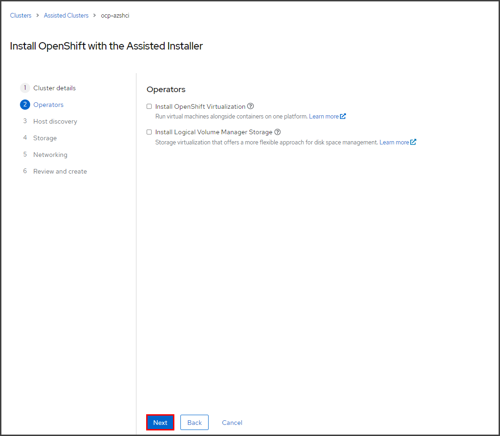

# Single Node OpenShift on Single Node Azure Stack HCI 
Within this blog, I will provide the process for installing a Single Node Azure Stack HCI server, and using the OpenShift Assisted-Installer to install Single Node OpenShift (SNO) onto it.
If installing Red Hat OpenShift onto an existing Azure Stack HCI environment, you could skip directly to _STEP 7_.

The combination of Single Node OpenShift running on a Single Node Azure Stack HCI server provides a suitable platform for running edge workloads.  In addition, OpenShift running on Azure Stack HCI on-premises can be used along with OpenShift running in Microsoft Azure to provide a solution for hybrid cloud workloads.

## **SINGLE NODE OPENSHIFT REQUIREMENTS:**
Single-Node OpenShift has the following [minimum resource requirements](https://docs.openshift.com/container-platform/4.11/installing/installing_sno/install-sno-preparing-to-install-sno.html#install-sno-requirements-for-installing-on-a-single-node_install-sno-preparing):
 - **CPU**: 8 vCPU cores
 - **Memory**: 16 GB of RAM
 - **Storage**: 120 GB 

To learn more about using the Assisted Installer, see the [Assisted Installer for OpenShift Container Platform documentation](https://access.redhat.com/documentation/en-us/assisted_installer_for_openshift_container_platform/2022/html-single/assisted_installer_for_openshift_container_platform/index) for details.

## **SINGLE NODE AZURE STACK HCI REQUIREMENTS:**
Make sure your system meets the [System requirements for Azure Stack HCI](https://learn.microsoft.com/en-us/azure-stack/hci/concepts/system-requirements?tabs=azure-public#server-requirements) for server and storage. 
 - **CPU**: Intel or AMD Processor of at least 1.4 GHz, and compatible with the x64 instruction set.
 - **Memory**: minimum of 32 GB of RAM for server operating system, VMs, and other apps or workloads.
 - **BIOS/UEFI settings**:  virtualization support is enabled for: Hardware-assisted virtualization and Hardware-enforced Data Execution Prevention (DEP). 
 - **Storage**: boot device supported by Windows Server. A 200 GB minimum size is recommended.

The [physical networking requirements for Single Node Azure Stack HCI](https://learn.microsoft.com/en-us/azure-stack/hci/plan/single-server-deployment#physical-connectivity-components) can be summarized:
- **Management & compute**:  At least 1 Gbps; 10 Gbps recommended. Two teamed ports.
- **Storage**: (**OPTIONAL**, to allow for adding a second server). At least 1 Gbps; 10 Gbps recommended.
- **BMC**: Varies based on server hardware manufacturer; most are at least 1 Gbps.

In addition, the following diagram summarizes the [physical network connectivity](https://learn.microsoft.com/en-us/azure-stack/hci/plan/single-server-deployment#network-atc-intents) used for a Single Node Azure Stack HCI deployment.

<p align="center"></p>


I installed Single-Node Azure Stack HCI onto a 1U rack server, with the following specs:
- CPU: 
  - Intel(R) Xeon(R) CPU E5-2680 v3 @ 2.50GHz (12 core)
- Memory: 384 GB
- Storage: 
  - (1) 120GB SATA SSD (boot/operating system)
  - (3) 400GB SAS SSD (storage pool)
- Network: 
  - Onboard dual-port 1GigE Intel I350 LOM
  - Mellanox ConnectX-4 LX dual-port 1/10/25/40/50 Gigabit Ethernet adapter 

You can learn more about the single-node Azure Stack HCI clusters on Microsoft Docs: 
 - [_Using Azure Stack HCI on a single server_](https://learn.microsoft.com/en-us/azure-stack/hci/concepts/single-server-clusters)
 - [_Deploy Azure Stack HCI on a single server_](https://learn.microsoft.com/en-us/azure-stack/hci/deploy/single-server)

<br></br>
## **STEP 1. INSTALL THE AZURE STACK HCI OS ON YOUR SERVER.**

<p align="center"></p>


Perform the steps from [_Deploy the Azure Stack HCI operating system_](https://learn.microsoft.com/en-us/azure-stack/hci/deploy/operating-system#manual-deployment), to download and install the Azure Stack HCI Operating System.

<br></br>
## **STEP 2. CONFIGURE THE SERVER UTILIZING THE SERVER CONFIGURATION TOOL (SCONFIG).**

<p align="center"></p>

Configure the server by performing these steps in [_SConfig_](https://learn.microsoft.com/en-us/windows-server/administration/server-core/server-core-sconfig#start-sconfig):

**a. Select 8 to set the network addresses and DNS settings.**

**b. Select 2 & 3 to set the computername and join an Active Directory Domain.**

**c. Select 6 to install the latest updates.**

<br></br>
## **STEP 3. INSTALL THE REQUIRED ROLES AND FEATURES WITH POWERSHELL.**

Run this `Install-WindowsFeature` command to install the required roles and features from PowerShell:

   ```bash
   Install-WindowsFeature -Name "BitLocker", "Data-Center-Bridging", "Failover-Clustering", "FS-FileServer", "FS-Data-Deduplication", "Hyper-V", "Hyper-V-PowerShell", "RSAT-AD-Powershell", "RSAT-Clustering-PowerShell", "NetworkATC", "Storage-Replica" -IncludeAllSubFeature -IncludeManagementTools
   ```
<br></br>
## **STEP 4. CREATE AN AZURE STACK HCI CLUSTER WITH POWERSHELL.**

Run this `New-Cluster` command to create an Azure Stack HCI cluster from PowerShell:
   ```bash
   New-Cluster -Name <cluster-name> -Node <node-name> -NOSTORAGE -StaticAddress <ipaddress>
   ```

Here's the command that I ran from PowerShell:   
   ```bash
   New-Cluster -Name AZSHCI-cluster -Node AZSHCI -NOSTORAGE -StaticAddress 192.168.2.183
   ```
   
<br></br>
## **STEP 5. REGISTER THE CLUSTER WITH POWERSHELL [OR WINDOWS ADMIN CENTER].**

Run these `Install-Module` and `Register-AzStackHCI` commands from PowerShell:
   ```bash
   Install-Module -Name Az.StackHCI
   
   Register-AzStackHCI  -SubscriptionId "<subscription_ID>" -ResourceGroupName <resourcegroup>
   ```
<br></br>
## **STEP 6. CREATE VOLUMES WITH POWERSHELL.**

Run this `New-Volume` command to create a volume from PowerShell:
   ```bash
   New-Volume -FriendlyName "S2D on AZSHCI-cluster" -Size 1TB -ProvisioningType Thin
   ```
<br></br>
## **STEP 7. GENERATE DISCOVERY ISO FROM THE ASSISTED INSTALLER:**

**a. Open the OpenShift Assisted Installer from the [_Red Hat Hybrid Cloud Console_](https://console.redhat.com/openshift/assisted-installer/clusters/):** 
 - You will be prompted for your `Red Hat ID` and `password` to login.

**b. Select '_Create New Cluster_'.**

<p align="center"></p>

**c. From the '_Cluster details_' step, enter the cluster name, the base domain; then select '_OpenShift 4.13.0_' and '_Install single node OpenShift (SNO)_', and click '_Next_'.**

<p align="center"></p>

**d. On the '_Operators_' step, click '_Next_'.**

<p align="center"></p>

**e. On the '_Host discovery_' step, select '_Add host_'.**

<p align="center"></p>

**f. Select '_Minimal Image File_' and '_Generate Discovery ISO_'.**

<p align="center"></p>

**g. Click on the '_Download Discovery ISO_' button.**

Save this ISO file for use in a later step, when creating the Virtual Machine for SNO.

<p align="center"></p>

**h. Click '_Close_' to return to the previous screen.**

<br></br>
## **STEP 8. FROM WINDOWS ADMIN CENTER, CREATE A VIRTUAL MACHINE FOR SINGLE NODE OPENSHIFT**

Install **Windows Admin Center**, which is the web-based management interface to manage Azure Stack HCI. You can install it onto a management PC, a Windows Server, or you may use it from the Azure Portal. For more information on installing and using Windows Admin Center in your environment, see the following:
 - [_Get started with Azure Stack HCI and Windows Admin Center_](https://learn.microsoft.com/en-us/azure-stack/hci/get-started)
 - [_Manage Azure Stack HCI clusters using Windows Admin Center in Azure (preview)_](https://learn.microsoft.com/en-us/windows-server/manage/windows-admin-center/azure/manage-hci-clusters)
 - [_Manage VMs with Windows Admin Center_](https://learn.microsoft.com/en-us/azure-stack/hci/manage/vm)

**a. From Windows Admin Center, navigate to 'Virtual Machines', select '_Add_, _+New_'.**

<p align="center"></p>

**b. Enter the Virtual Machine Name, and the virtual processors, memory, and network settings.**

The minimum resource requirements for Single-Node OpenShift are **CPU**: 8 vCPUs, **Memory**: 16 GB, **Storage**: 120 GB 

<p align="center"></p>

**c. Continue, scrolling down to the Storage category, select '_+ Add_' and continuing below.**

<p align="center"></p>

**d. Continue, in the '_Storage_' category, create an empty virtual hard disk of at least 120GB.**

**e. Continue, in the '_Operating System_' category, select 'Install an operating system from an image file (.iso)', and click on the '_Browse_' button to select the Discovery ISO file.**

**NOTE:** You will have to transfer the Discovery ISO file from where you downloaded it earlier, to the Azure Stack HCI server.

<p align="center"></p>

**f. When complete, select '_Create_'.**

<p align="center"></p>

**g. Continue by editing the settings for the VM. Click on '_Settings_' (the gear icon), then under the _Security_ category, uncheck '_Enable Secure Boot_'. Select '_Save Security Settings_', then click '_Close_'.**

<p align="center"></p>

This will allow you to boot from the Discovery ISO image, without it having a signed hash.  For more information see [_Generation 2 virtual machine security settings for Hyper-V_](https://learn.microsoft.com/en-us/windows-server/virtualization/hyper-v/learn-more/generation-2-virtual-machine-security-settings-for-hyper-v).

<br></br>
## **STEP 9. BOOT THE VIRTUAL MACHINE FROM THE DISCOVERY ISO:**

**a. From _Virtual Machines_, select the VM and then '_Power_, _Start_'.**

<p align="center"></p>

**b. To connect to the VM console to watch it during boot, select the VM and then '_Connect_, _Connect_'.**

<p align="center"></p>

<br></br>
## **STEP 10. RETURN TO THE ASSISTED INSTALLER TO FINISH THE INSTALLATION:**

Return to the OpenShift Assisted Installer.
 
 **a. You should see the SNO VM displayed in the list of discovered servers. 
      From the '_Host discovery_' menu, once the SNO VM is discovered, click '_Next_'.**
 
<p align="center"></p>

 **b. From the '_Storage_' menu, click on '_Next_' to proceed.**
 
<p align="center"></p>

 **c. From the '_Networking_' menu, confirm the discovered/selected 'machine network', and click on '_Next_' to proceed.**

<p align="center"></p>

**d. Review the configuration, and click on '_Install Cluster_'.**

<p align="center"></p>

**e. Monitor the installation progress.**

<p align="center"></p>

<p align="center"></p>

**f. Installation Complete.**

Upon completion, you'll see the summary of the installation, and you'll be able to _download the kubeconfig file_, 
_copy the kubeadmin password_, and _launch the OpenShift Web console_.

<p align="center"></p>

If you have problems accessing the OpenShift Web Console, the installation summary screen also provides some troubleshooting tips to check your DNS server or local configuration to resolve its hostname.  You can add/confirm the API and Ingress VIP addresses to your DNS server, or you can update your local `/etc/hosts` or `/etc/resolv.conf` files.  To access these troubleshooting tips, click on **_Not able to access the Web Console?_**
<br></br>

## **CONCLUSION**

