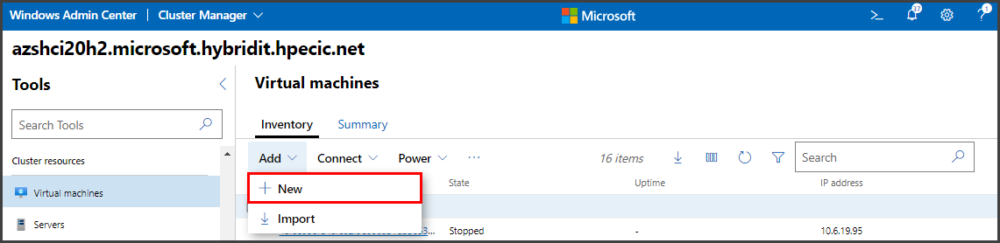

# Single Node OpenShift on HPE GreenLake for Azure Stack HCI 
Within this blog, I will provide the process for installing Single Node OpenShift (SNO) onto HPE GreenLake for Azure Stack HCI, using the OpenShift Assisted-Installer.
The combination of Single Node OpenShift running on a Azure Stack HCI provides a suitable platform for running edge and hybrid cloud workloads.  

## **SINGLE NODE OPENSHIFT REQUIREMENTS:**
Single-Node OpenShift has the following [minimum resource requirements](https://docs.openshift.com/container-platform/4.11/installing/installing_sno/install-sno-preparing-to-install-sno.html#install-sno-requirements-for-installing-on-a-single-node_install-sno-preparing):
 - **CPU**: 8 vCPU cores
 - **Memory**: 16 GB of RAM
 - **Storage**: 120 GB 

In addition, the Assisted Installer can install the _Logical Volume Manager Storage operator_ to manage persistent storage for OpenShift. Additional requirements for the LVM Storage operator are:
 - **CPU**: 1 vCPU cores
 - **Memory**: 400 MiB of RAM
 - **Storage**: 1 additional installation disk (empty) 

For more information, see the [Persistent storage using logical volume manager storage documentation](https://docs.openshift.com/container-platform/4.13/storage/persistent_storage/persistent_storage_local/persistent-storage-using-lvms.html).

To learn more about using the Assisted Installer, see the [Assisted Installer for OpenShift Container Platform documentation](https://access.redhat.com/documentation/en-us/assisted_installer_for_openshift_container_platform/2022/html-single/assisted_installer_for_openshift_container_platform/index) for details.

## **HPE GREENLAKE FOR MICROSOFT AZURE STACK HCI**
Get reliable solid performance and high availability for HCI—all through a pay-per-use model, using native Azure experience and capabilities. HPE GreenLake for Microsoft Azure Stack HCI features a choice of ready-to-go validated solution configurations, based on specific HPE technologies that are tested, optimized, and validated with Azure Stack HCI OS. 
 - **Integrated system**: HW, SW and services solution delivered as-a-service and with a pay-as-you-go model.
 - **Monthly billing** from HPE based on consumption of compute and storage resources.
 - **Single bill** can include all charges--including AzureStack HCI, Azure Services (backup, etc), with HPE as the CSP. 

For additional details, see the [HPE GreenLake for Microsoft Azure Stack HCI solution brief](https://www.hpe.com/psnow/doc/a50003801enw.pdf?jumpid=in_pdfviewer-psnow).

The following diagram shows the HPE GreenLake for Microsoft Azure Stack HCI environment used for this installation of Red Hat OpenShift:

  

## **STEP 1. GENERATE DISCOVERY ISO FROM THE ASSISTED INSTALLER:**

Perform the following steps to install Single Node OpenShift (SNO) onto HPE GreenLake for Azure Stack HCI:

**a. Open the OpenShift Assisted Installer from the [_Red Hat Hybrid Cloud Console_](https://console.redhat.com/openshift/assisted-installer/clusters/):** 
 - You will be prompted for your `Red Hat ID` and `password` to login.

**b. Select "_Create New Cluster_".**

**c. From the "_Cluster details_" step, enter the cluster name, the base domain; then select "_OpenShift 4.13.0_" and "_Install single node OpenShift (SNO)_", and click "_Next_".**

**d. On the "_Operators_" step, select "_Install Logical Volume Manager Storage_" and click "_Next_".**

**e. On the "_Host discovery_" step, select "_Add host_".**

**f. Select "_Minimal Image File_" and "_Generate Discovery ISO_".**

**g. Click on the "_Download Discovery ISO_" button.**

Save this ISO file for use in a later step, when creating the Virtual Machine for SNO.

**h. Click "_Close_" to return to the previous screen.**

  
## **STEP 2. FROM WINDOWS ADMIN CENTER, CREATE A VIRTUAL MACHINE FOR SINGLE NODE OPENSHIFT**

**Windows Admin Center** is the web-based management interface to manage Azure Stack HCI. You can install it onto a management PC, a Windows Server, or you may use it from the Azure Portal. For more information on installing and using Windows Admin Center in your environment, see the following:
 - [_Get started with Azure Stack HCI and Windows Admin Center_](https://learn.microsoft.com/en-us/azure-stack/hci/get-started)
 - [_Manage Azure Stack HCI clusters using Windows Admin Center in Azure (preview)_](https://learn.microsoft.com/en-us/windows-server/manage/windows-admin-center/azure/manage-hci-clusters)
 - [_Manage VMs with Windows Admin Center_](https://learn.microsoft.com/en-us/azure-stack/hci/manage/vm)

**a. From Windows Admin Center, navigate to "Virtual Machines", select "_Add_, _+New_".**

The minimum resource requirements for Single-Node OpenShift with the LVM Storage operator are **CPU**: 9 vCPUs, **Memory**: 16 GB, **Storage**: 120 GB 

**b. Enter the Virtual Machine Name.**

**c. Enter the virtual processors, memory, and network settings.**

**c. Continue, scrolling down to the Storage category, select "_+ Add_" and continuing below.**

**d. Continue, in the "_Storage_" category, create an empty virtual hard disk of at least 120GB.**

**e. Continue, in the "_Operating System_" category, select "Install an operating system from an image file (.iso)", and click on the "_Browse_" button to select the Discovery ISO file.**

**NOTE:** You will have to transfer the Discovery ISO file from where you downloaded it earlier, to the Azure Stack HCI server.

**f. When complete, select "_Create_".**

**g. Continue by editing the settings for the VM. Click on "_Settings_" (the gear icon), then under the _Security_ category, uncheck "_Enable Secure Boot_". Select "_Save Security Settings_", then click "_Close_".**

This will allow you to boot from the Discovery ISO image, without it having a signed hash.  For more information see [_Generation 2 virtual machine security settings for Hyper-V_](https://learn.microsoft.com/en-us/windows-server/virtualization/hyper-v/learn-more/generation-2-virtual-machine-security-settings-for-hyper-v).

  
## **STEP 3. BOOT THE VIRTUAL MACHINE FROM THE DISCOVERY ISO:**

**a. From _Virtual Machines_, select the VM and then "_Power_, _Start_".**

**b. To connect to the VM console to watch it during boot, select the VM and then "_Connect_, _Connect_".**

  
## **STEP 4. RETURN TO THE ASSISTED INSTALLER TO FINISH THE INSTALLATION:**

Return to the OpenShift Assisted Installer.
 
 **a. You should see the SNO VM displayed in the list of discovered servers. 
      From the "_Host discovery_" menu, once the SNO VM is discovered, click "_Next_".**
 

 **b. From the "_Storage_" menu, click on "_Next_" to proceed.**
 

 **c. From the "_Networking_" menu, confirm the discovered/selected "machine network", and click on "_Next_" to proceed.**

**d. Review the configuration, and click on "_Install Cluster_".**

**e. Monitor the installation progress.**

**f. Installation Complete.**

Upon completion, you'll see the summary of the installation, and you'll be able to _download the kubeconfig file_, 
_copy the kubeadmin password_, and _launch the OpenShift Web console_.

If you have problems accessing the OpenShift Web Console, the installation summary screen also provides some troubleshooting tips to check your DNS server or local configuration to resolve its hostname.  You can add/confirm the API and Ingress VIP addresses to your DNS server, or you can update your local `/etc/hosts` or `/etc/resolv.conf` files.  Click on **_Not able to access the Web Console?_**, to access these troubleshooting tips.
  

## **CONCLUSION**

