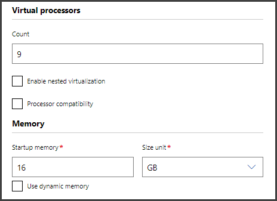
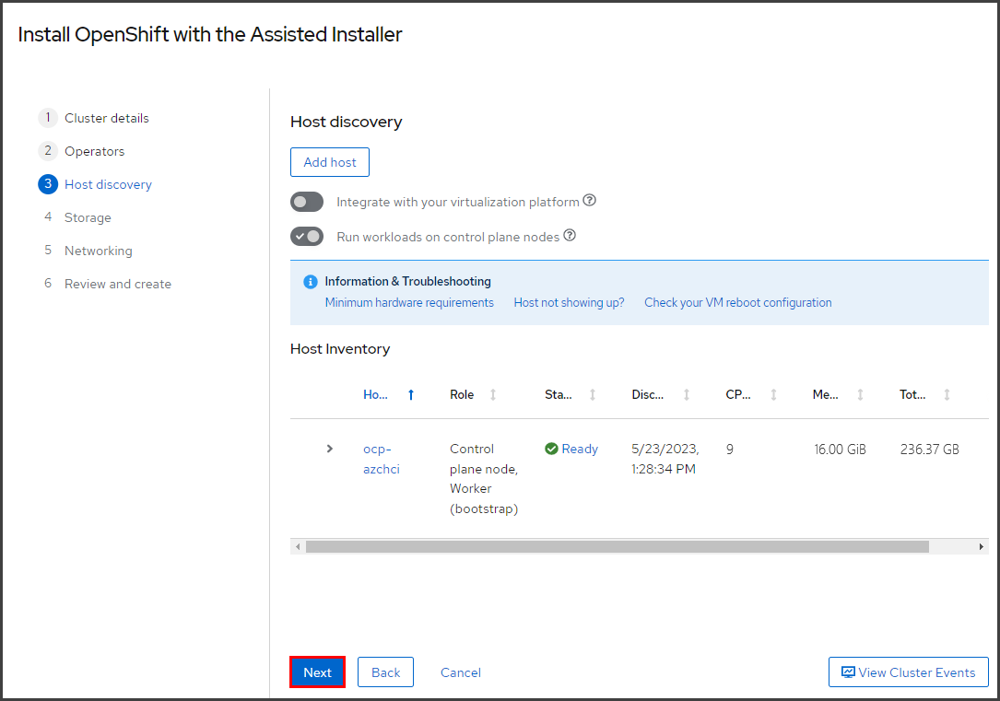

# Single Node OpenShift on HPE GreenLake for Azure Stack HCI 
Within this blog, I will provide the process for installing Single Node OpenShift (SNO) onto HPE GreenLake for Azure Stack HCI, using the OpenShift Assisted Installer.
The combination of Single Node OpenShift running on a Azure Stack HCI provides a suitable platform for running edge and hybrid cloud workloads.  

## **SINGLE NODE OPENSHIFT REQUIREMENTS:**
Single Node OpenShift has the following [minimum resource requirements](https://docs.openshift.com/container-platform/4.11/installing/installing_sno/install-sno-preparing-to-install-sno.html#install-sno-requirements-for-installing-on-a-single-node_install-sno-preparing):
 - **CPU**: 8 vCPU cores
 - **Memory**: 16 GB of RAM
 - **Storage**: 120 GB (operating system disk)

Besides Single Node OpenShift, the Assisted Installer is also capable of installing OpenShift clusters using additional configurations, such as a 3-node compact cluster, or a multiple control-plane, and worker node cluster. 

To learn more about using the Assisted Installer, see the [Assisted Installer for OpenShift Container Platform documentation](https://access.redhat.com/documentation/en-us/assisted_installer_for_openshift_container_platform/2022/html-single/assisted_installer_for_openshift_container_platform/index) for details.
  

**PERSISTENT STORAGE INTEGRATION WITH AZURE STACK HCI**

There are two solutions provided here, to integrate the persistent storage for the OpenShift cluster to the shared HCI storage volume(s) provided from the Microsoft Azure Stack HCI cluster.  This is done by providing additional local disk device(s) from the shared volume within the host virtual machine(s) (VMs) used for OpenShift.  This varies based on whether OpenShift is configured to run on a single node (single VM), or on multiple nodes (multiple VMs).

 - **Single Node OpenShift:** _Logical Volume Manager Storage operator_

   Since SNO runs in a single host VM, an additional local disk device is added to the VM, which is then used by the Logical Volume Manager Storage operator to provide persistent storage for the OpenShift cluster.
   
   The Assisted Installer can install the _Logical Volume Manager Storage operator_ to manage persistent storage for SNO. The additional requirements for the LVM Storage operator are:
    - **CPU**: 1 vCPU cores
    - **Memory**: 400 MiB of RAM
    - **Storage**: 1 additional non-installation disk (empty) 

   For more information, see the [Persistent storage using logical volume manager storage documentation](https://docs.openshift.com/container-platform/4.13/storage/persistent_storage/persistent_storage_local/persistent-storage-using-lvms.html).
   
 - **Multi-Node OpenShift:** _Red Hat OpenShift Data Foundation (ODF)_

   [OpenShift Data Foundation](https://www.redhat.com/en/resources/openshift-data-foundation-datasheet) is setup to run in Internal mode, across a minimum of three nodes within the cluster.  So, three of the host VMs are setup with an additional local disk device, to be used by ODF to provide persistent storage for the OpenShift cluster. 
   
   The Assisted Installer can install the _OpenShift Data Foundation_ operators to manage persistent storage for OpenShift. The additional requirements for ODF per host VM node are:
    - **CPU:** 6 vCPU cores (for 3-node OpenShift), or 8 vCPU cores (for standard OpenShift)
    - **Memory:** 19 GiB of RAM
    - **Storage:** 1 non-installation disk of at least 25GB (empty) 
    - **Additional:** 2 CPU cores and 5GiB RAM per storage disk 

For more information, see the [Deployment Planning Guide for Red Hat OpenShift Data Foundation 4.12](https://access.redhat.com/documentation/en-us/red_hat_openshift_data_foundation/4.12/html-single/planning_your_deployment/index).

**NOTE:** This blog shows the process to install _Single Node OpenShift_ on Azure Stack HCI, so the _Logical Volume Manager Storage operator_ will be used for persistent storage.
  

**NETWORKING REQUIREMENTS**

You will also need to create DNS records for the API and Ingress VIP addresses on your DNS server:
 - A DNS A/AAAA record for `api.<cluster_name>.<base_domain>`.
 - A DNS A/AAAA record with a wildcard for `*.apps.<cluster_name>.<base_domain>`.

With SNO, a single IP address is used for both of these records.  The Assisted Installer defaults to using DHCP networking. During the installation, after booting the VM with the discovery ISO, you will be able to view the IP address that was allocated. The Assisted Installer can also be configured to use static IP addressing.

For more information, see the [Networking requirements](https://access.redhat.com/documentation/en-us/assisted_installer_for_openshift_container_platform/2022/html-single/assisted_installer_for_openshift_container_platform/index#networking) in the Assisted Installer documentation.

  
## **HPE GREENLAKE FOR MICROSOFT AZURE STACK HCI**
HPE GreenLake for Microsoft Azure Stack HCI provides a pay-per-use model, using a native Azure experience and capabilities. It features a choice of ready-to-go validated solution configurations, based on specific HPE technologies that are tested, optimized, and validated with Azure Stack HCI OS. 
 - **Integrated system**: HW, SW and services solution delivered as-a-service and with a pay-as-you-go model.
 - **Monthly billing** from HPE based on consumption of compute and storage resources.
 - **Single bill** can include all charges--including AzureStack HCI, Azure Services (backup, etc), with HPE as the CSP. 

For additional details, see the [HPE GreenLake for Microsoft Azure Stack HCI solution brief](https://www.hpe.com/psnow/doc/a50003801enw.pdf?jumpid=in_pdfviewer-psnow).

   **NOTE:** At the time of this blog, Red Hat OpenShift Container Platform running on _HPE GreenLake for Microsoft Azure Stack HCI_ does not currently utilize a pay-as-you-go based subscription.  It would utilize a traditional subscription for Red Hat OpenShift.

The following diagram shows the HPE GreenLake for Microsoft Azure Stack HCI environment used for this installation of Red Hat OpenShift:

  

---

## **STEP 1. GENERATE DISCOVERY ISO FROM THE ASSISTED INSTALLER:**

1. Perform the following steps to install Single Node OpenShift (SNO) onto HPE GreenLake for Azure Stack HCI:
 
   1. **Open the OpenShift Assisted Installer from the [_Red Hat Hybrid Cloud Console_](https://console.redhat.com/openshift/assisted-installer/clusters/):**
      - You will be prompted for your `Red Hat ID` and `password` to login.

   1. **Select "_Create New Cluster_".** 

   1. **From the "_Cluster details_" step, enter the cluster name, the base domain; then select "_OpenShift 4.13.0_" and "_Install single node OpenShift (SNO)_", and click "_Next_".** 

 
   1. **On the "_Operators_" step, select "_Install Logical Volume Manager Storage_" and click "_Next_".** 

    1. **On the "_Host discovery_" step, select "_Add host_".** 

    1. **Select "_Minimal Image File_" and "_Generate Discovery ISO_".** 

    1. **Click on the "_Download Discovery ISO_" button.** Save this ISO file for use in a later step, when creating the Virtual Machine for SNO. 

    1. **Click "_Close_" to return to the previous screen.**

  

## **STEP 2. FROM WINDOWS ADMIN CENTER, CREATE A VIRTUAL MACHINE FOR SINGLE NODE OPENSHIFT**

**Windows Admin Center** is the web-based management interface to manage Azure Stack HCI. You can install it onto a management PC, a Windows Server, or you may use it from the Azure Portal. For more information on installing and using Windows Admin Center in your environment, see the following:
 - [_Get started with Azure Stack HCI and Windows Admin Center_](https://learn.microsoft.com/en-us/azure-stack/hci/get-started)
 - [_Manage Azure Stack HCI clusters using Windows Admin Center in Azure (preview)_](https://learn.microsoft.com/en-us/windows-server/manage/windows-admin-center/azure/manage-hci-clusters)
 - [_Manage VMs with Windows Admin Center_](https://learn.microsoft.com/en-us/azure-stack/hci/manage/vm)

   We will create a virtual machine to be used for Single-Node OpenShift, based on the minimum resource requirements with the LVM Storage operator:
 - **CPU**: 9 vCPUs
 - **Memory**: 16 GB
 - **Storage**: 120 GB (for RHEL CoreOS operating system)
 - **Storage**: 100 GB (for OpenShift persistent storage using the LVM Storage operator)

 - **a. From Windows Admin Center, navigate to "Virtual Machines", select "_Add_, _+New_".**

 - **b. Enter the Virtual Machine Name.**

 - **c. Continue, scrolling down, enter the Virtual processors and Memory settings.**

 - **d. Continue, scrolling down, selecting the Network virtual switch for your environment.**

   **Then, click on "_+ Add_" under Storage to create new disk 1, continuing below.**

 - **e. Continue, by creating an empty virtual hard disk of at least 120GB for disk 1.**

   **Then, click on "_+ Add_" to create new disk 2, continuing below.**

 - **f. Continue, by creating an empty virtual hard disk of at least 100GB for disk 2.**

   **In the "_Operating System_" category, select "Install an operating system from an image file (.iso)", and click on the "_Browse_" button to select the Discovery ISO file.**
   
   **NOTE:** You will have to transfer the Discovery ISO file from the location you downloaded it earlier, to the _Azure Stack HCI Cluster Storage Shared Volume_.

   **When complete, select "_Create_".**   
   

 - **g. Continue by editing the settings for the VM. Click on "_Settings_" (the gear icon), then under the _Security_ category, uncheck "_Enable Secure Boot_". Select "_Save Security Settings_", then click "_Close_".**

This will allow you to boot from the Discovery ISO image, without it having a signed hash.  For more information see [_Generation 2 virtual machine security settings for Hyper-V_](https://learn.microsoft.com/en-us/windows-server/virtualization/hyper-v/learn-more/generation-2-virtual-machine-security-settings-for-hyper-v).

  
## **STEP 3. BOOT THE VIRTUAL MACHINE FROM THE DISCOVERY ISO:**

 - **a. From _Virtual Machines_, select the VM and then "_Power_, _Start_".**

 - **b. To connect to the VM console to watch it during boot, select the VM and then "_Connect_, _Connect_".**

  
## **STEP 4. RETURN TO THE ASSISTED INSTALLER TO FINISH THE INSTALLATION:**

Return to the OpenShift Assisted Installer.
 
 - **a. You should see the SNO VM displayed in the list of discovered servers. 
      From the "_Host discovery_" menu, once the SNO VM is discovered, click "_Next_".**
 

 - **b. From the "_Storage_" menu, click on "_Next_" to proceed.**
 

 - **c. From the "_Networking_" menu, confirm the discovered/selected "machine network", and click on "_Next_" to proceed.**

 - **d. Review the configuration, and click on "_Install Cluster_".**

 - **e. Monitor the installation progress.**

 - **f. Installation Complete.**

Upon completion, you'll see the summary of the installation, and you'll be able to _download the kubeconfig file_, 
_copy the kubeadmin password_, and _launch the OpenShift Web console_.

If you have problems accessing the OpenShift Web Console, the installation summary screen also provides some troubleshooting tips to check your DNS server or local configuration to resolve its hostname.  You can add/confirm the API and Ingress VIP addresses to your DNS server, or you can update your local `/etc/hosts` or `/etc/resolv.conf` files.  Click on **_Not able to access the Web Console?_**, to access these troubleshooting tips.
  

## **CONCLUSION**

